<!-- markdown-toc start - Don't edit this section. Run M-x markdown-toc-refresh-toc -->
**Table of Contents**

- [eLinkKVM Guide](#elinkkvm-guide)
    - [Chapter 1: Introduction](#chapter-1-introduction)
        - [a. Overview](#a-overview)
        - [b. Features](#b-features)
            - [Booster](#booster)
        - [c. Bundled hardware components](#c-bundled-hardware-components)
        - [d. Technical Specifications](#d-technical-specifications)
            - [i. Security](#i-security)
            - [ii. Target Server Requirements](#ii-target-server-requirements)
                - [Operating Sytems](#operating-sytems)
            - [Hardware specification](#hardware-specification)
                - [Front view](#front-view)
                - [Rear view](#rear-view)
                - [Internal](#internal)
            - [eLinkViewer](#elinkviewer)
    - [Chapter 2: Hardware Setup](#chapter-2-hardware-setup)
        - [a. First Power On](#a-first-power-on)
            - [Devices and cables](#devices-and-cables)
            - [Remote computer](#remote-computer)
            - [Local computer](#local-computer)
            - [eLinkKVM configuration](#elinkkvm-configuration)
        - [b. Network configuration](#b-network-configuration)
            - [Windows](#windows)
        - [c. Setup verification](#c-setup-verification)
    - [Chapter 3: Remote management software for eLinkKVM with eLinkViewer](#chapter-3-remote-management-software-for-elinkkvm-with-elinkviewer)
        - [a. Basic usage](#a-basic-usage)
            - [Login](#login)
            - [Quick usage](#quick-usage)
            - [Disconnect from an eLinkKVM device](#disconnect-from-an-elinkkvm-device)
        - [b. Dummy Screen](#b-dummy-screen)
            - [i. Home](#i-home)
            - [ii. Info/Status](#ii-infostatus)
            - [iii. Networks](#iii-networks)
            - [iv. COM Port](#iv-com-port)
            - [v. IPMI](#v-ipmi)
            - [vi. Admin](#vi-admin)
            - [vii. Upgrade](#vii-upgrade)
        - [c. eLinkKVM Toolbar](#c-elinkkvm-toolbar)
        - [d. Keyboard, Video and Mouse Settings](#d-keyboard-video-and-mouse-settings)
            - [Key:](#key)
            - [Mouse:](#mouse)
            - [Video:](#video)
            - [File browsing and disk image mounting:](#file-browsing-and-disk-image-mounting)
        - [e. Python Cnsole UI](#e-python-cnsole-ui)
        - [f. Event Log UI](#f-event-log-ui)
        - [g. IPMI Command Center](#g-ipmi-command-center)
    - [Chapter 4: eLinkKVM Configuration](#chapter-4-elinkkvm-configuration)
        - [a. User Management](#a-user-management)
        - [b. Network Configuration](#b-network-configuration)
            - [-](#-)
            - [Dynamic IP Configuration](#dynamic-ip-configuration)
        - [c. IPMI Configuration](#c-ipmi-configuration)
        - [d. Offline Configuration](#d-offline-configuration)
        - [e. Factory Reset](#e-factory-reset)
    - [Chapter 5: Booster Mode](#chapter-5-booster-mode)
        - [Customize Booster Mode](#customize-booster-mode)
    - [Chapter 6: elinkSetuptool](#chapter-6-elinksetuptool)

<!-- markdown-toc end -->


# eLinkKVM Guide

## Chapter 1: Introduction

### a. Overview

A KVM switch (an abbreviation stands for **K**eyboard, **V**ideo and
**M**ouse") is a hardware device that enables a user to control
multiple computers from one or more sets of keyboards, video monitors,
and mice. For examle, in the following diagram, the computer on the
right is currently being controlled by the peripherals.

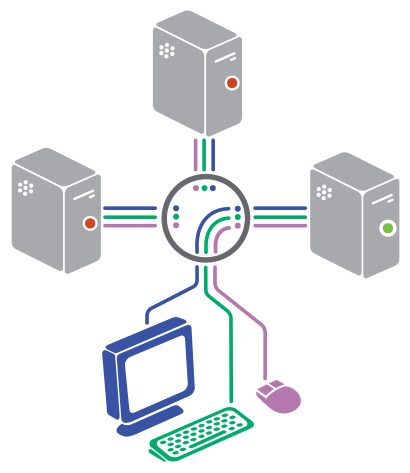

[TODO] Replace Wikipedia diagram about with our original diagram

Unlike software solutions for remote controlling, a hardware solution
like a KVM switch can be used as a replacement for a computer monitor.
This diagram demonstrates the scope difference between a software and
a hardware solution:

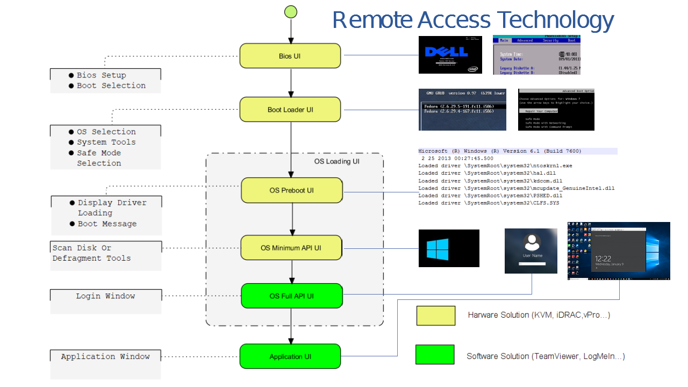

Normal KVM switches attach controlling and controlled devices directly
to itself. In constrast, KVM over-IP switches, provides
over-the-internet functionality. This means, instead of physically
connected to a KVM switch through very long cables and are usually
limited in a room, a floor or a building, the controlling devices can
be anywhere in the world that can connect to a KVM over-IP switch and
control the connected computers with a normal Internet connection.

eLinkKVM is one of such KVM-over-IP devices. However, unlike other
KVM-over-IP solutions that are solely hardware solutions, eLinkKVM
takes on a unique hybrid approach that combines both hardware and
software. While being a hardware solution similar to other KVM-over-IP
switches, but unlike other KVM-over-IP switches, eLinkKVM takes a step
further with its patented technology called `Booster`. `Booster` is a
software solution that works together with eLinkKVM hardware to uplift
processing performance by utilizing computing resources of the
controlled computers. `Booster` is not limited to an operating system
environment, but also in BIOS and UEFI environments.

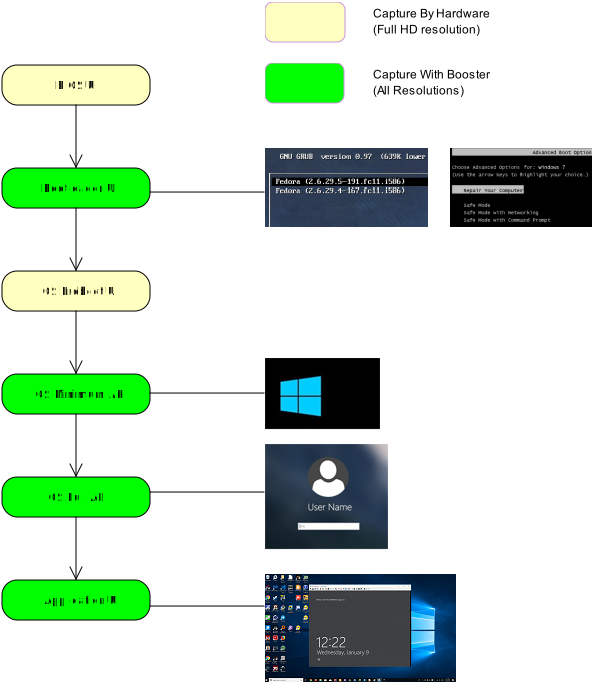

Operators can monitor and access their computers from remote
locations using a remote control software. An eLinkKVM device connects
to a local area network or directly to a personal computer (PC) using
a standard ethernet cable, then uses a USB cable and a video display
cables to connect to a server and complete control it with Keyboard,
Video and Mouse functionliaty from the eLinkKVM device.

Because the eLinkKVM uses the Internet as its data communication
medium, the server it is connected to can be accessed from any
authorized computer across the Internet, regardless of physical
location.

A user at a remote location connect to the eLinkKVM via its IP
address. Once a connection has been established and authorization
granted, the remote computer can exchange keyboard, video and mouse
signals with the remote server (of which the eLinkKVM is attached
to**, just as if they were physically present and working on the
equipment directly.

### b. Features ###

The eLinkKVM is designed to help the IT person remotely operate the
Server in most repsonvive and efficient way. We invent a new
technology and make some enhance versus the old tradional KVM over IP
and below are the main feature:

- **Full Bios-level control over an IP Network**

  The video capture hardware (Hardware mode) is designed to decode the
  video signal up to 1920x1080 that help to monitor the screen in any
  situation.
  
- **Patented Booster technology**

  Faster and higher resolution with Booster technology, a patent
  technolgy allows monitor the screen with faster transfer, any video
  resolution with just a USB connection for almost any situation. See
  the **Booster** chapter for more information.

- **Featureful native client software***

  Client software is bundled with many unique features: scripting and
  image recognization, to automate manual operations. See the
  eLinkViewer chapter for more information.
        
* **Virtual Media support with 8GB Internal Flash or 64GB with SD Card** 
  
  Instead of using a separate computer as a share network storage to
  emulate the Virtual Media, eLinkKVM itself is a high performance
  shared netork storage device.
        
* **Server Power Design**

  No external power supply required

* **RS232 Serial Port**

  For Serial Console, Remote Dial In or control external PDU
  
* **Built-in IPMI (Intelligent Platform Management Interface) utility**

  eLinkKVM understands IPMI and allows control the server that support
  IPMI interface. The user may power on/off/reset or getting IPMI
  events from server.

* **Support USB Host Interface**

  Allow control USB 3G/4G, external USB storage or USB security device
  to add more functionality.

* **Flexible 2 Ethernet Ports** 

  The Ethernet ports can be configured to work indepently to connect 2
  different networks with the master port can be configured as a DHCP
  server. Or 2 ports can be used to connect a server to a router,
  using a single server Ethernet port.

* **Built-In USB Hub** 

  Physically emulate all USB device (Mouse, Keyboard, Storage) with
  just one USB cables

* **Scalability** 

  eLinkKVM can scale to control more than one computers by
  connecting the computers to eLinkSwitch.
  
* **Compact form factor**

  Small footprint of eLinkKVM making it easy to attach to existing servers

* **Low cost**

  Ideal for distributed IT system environments such as small branch
  offices, campuses, test labs, and server hosting environments.

#### Booster ####

**Booster*** is a patented technology that allows eLinkKVM to utilize
computing resources from controlled computers to improve remote
performance. To quickly summarize, Booster includes software agents
that work on major OS platforms (Windows, Linux and Mac OS**; however,
unlike traditional software solutions, Booster agents can also operate
in BIOS and UEFI environments, indepdent of any operating
system. 

These software agents are installed on controlled computers to utilize
the extra computing power on the controlled computers to accelerate
screen data processing without affecting performance. This enables
higher quality remote screen and more responsive interactions with
the remotely controlled computers.

**Booster** also helps reducing the loads on eLinkKVM devices, making
eLinkKVM devices run cooler and extend the longevity of eLinkKVM
devices, while delivering higher performance.

The following diagram shows the scope covered by Booster:


### c. Bundled hardware components

- 1 eLinkKVM device 
- 1 Ethernet RJ45 cable
- 1 USB type B cable

### d. Technical Specifications

#### i. Security

- Secure by SSL
- Multiple Login Accounts (Up to 8 users)

#### ii. Target Server Requirements

##### Operating Sytems #####

Supported operating systems for a local computer:

- Windows 7, 8, 10.
- Windows Server 2012.


#### Hardware specification ####


##### Front view #####

| ID | Component  | Description                                                                                      |
|----|------------|--------------------------------------------------------------------------------------------------|
| 1  | USB Type-B | power the device and acts as a communication channel between eLinkKVM and a server               |
| 2  | Power      | the secondary source is supplied by a micro USB cable. It is neccessary when the power           |
|    |            | from USB Type B port is insufficient, or keeping the connection to eLinkKVM                      |
|    |            | alive when the server is power off.                                                              |
| 3  | VGA        | For capturing and outputting video signal to send and receive over the internet.                 |
| 4  | RS232      | the serial communication port (COM port**. This port will be connected to the server serial port. |

##### Rear view ######

| ID | Component                   | Description                                                              |
|----|-----------------------------|--------------------------------------------------------------------------|
| 1  | Ethernet ports (10/100Mbps) | Master: can be configured as a DHCP server, a DHCP client or a static IP |
|    |                             | Slave: can be configured as a DHCP Client or a static IP                 |
|    |                             |                                                                          |
| 2  | SD card                     | allows a user to expand storage capacity with an external micro SD card  |
| 3  | Status Leds 1,2,3           | signal device statuses through different led colors                      |
| 4  | USB Type-A                  | allow to attach an external peripheral device such as USB 3G/4G,         |
|    |                             | USB Mass Storage, etc., to extend eLinkKVM functionality.                |

##### Internal #####

| Feature                     | Description                                                                   |
|-----------------------------|-------------------------------------------------------------------------------|
| Storage                     | Internal Flash Storage (8GB) that can be accessed by eLinkViewer software     |
| Remote Server Power Control | Remote Reset/On/Off  Server                                                   |
|                             | Control the External PDU through RS232                                        |
| Virtual Media               | Disk images (.iso, .raw, .hdd, .hdd2** can be mounted as a USB 2.0 devices on |
| Server power design         | No external power supply required                                             |
|                             | on a remote computer for easy software installation and system updates        |
| Batch setup                 | Multiple eLinkKVM devices can be scripted by the eLinkViewer software to get  |
|                             | the same configuration.                                                       |

#### eLinkViewer ####

**eLinkViewer*** is an application specifically made to view remote
screen content captured by an eLinkKVM device as well as interact with
a remote computer. 

**eLinkViewer** also provides functionalities to manage an eLinkKVM device.
    
| Feature                | Description                                                                      |
|------------------------|----------------------------------------------------------------------------------|
| General                | Support multiple VNC Server and eLinkKVM                                         |
|                        | Remote protocol using VNC and extension commands for eLinkKVM                    |
|                        | Support video scaling and full screen                                            |
| Automation             | Support image recognization and Python scripting allow automation the activities |
| IPMI                   | Support IPMI protocol to control server with GUI                                 |
| Platform               | Currently support Windows                                                        |
| Bandwidth Optimization | Provide video quality settings to maximze remote performance for the available   |
|                        | network bandwith                                                                 |
| Screen scaling         | Viewer screen can be scaled to any resolution independent from remote computer's |
|                        | resolution or even enter a full-screen mode. In full-screen mode, the viewer     |
|                        | screen scales according to the remote computer's resolution.                     |

## Chapter 2: Hardware Setup ###

### a. First Power On ###

#### Devices and cables

- 1 computer to be controlled
- 1 eLinkKVM device 
- 1 Ethernet RJ45 cable
- 1 USB type B cable

Optional:

- 1 Micro USB cable connected to a 5v power source
- 1 VGA cable
- 1 RS232 cable

#### Remote computer ####
    
A remote computers is a computer connected to the control cables
(USB for input and VGA for output) that are connected to an eLinkKVM
device. The following equipment must be available a remote computer:

 - 1 VGA port
 - 1 USB Type-A port at the minimum.

#### Local computer ####

A local computer is a computer that a user physically interact with,
e.g. a laptop, to control a remote computer through an eLinkKVM device
connected to the remote computer.

#### eLinkKVM configuration ####

 

1. Use a USB Type-B cable to connect a remote computer and the Type-B port of an eLinkKVM device.
2. Use a Micro USB cable to connect to a 5v power supply.

A user can use one of the two methods or both to power up a device.  A
USB Type-B connector from the server to an eLinkKVM device suffices to
power up the device. But in some cases, it is necessary to keep the
device active, while the server can be turned off. This can be done by
supplying another 5V power source to the micro USB port on an eLinkKVM
device.

### b. Network configuration ###

eLinkKVM supports two Ethernet ports for network connection:

- Ethernet Master: by default, configured as a DHCP server.
- Ethernet Slave: by default, configured as a DHCP client.

To connect to an eLinkKVM device, a network connection between a local
computer and an eLinkKVM device is required. The connection can either
be:

- *Direct connect*: An Ethernet cable connects directly between a
  local computer and an eLinkKVM device.
  
- *Local Area Network*: Both the local computer and an eLinkKVM device
  are connected to a local area network (LAN). eLinkKVM is plugged to
  the router of the network.
  
- *Over the Internet*: an eLinkKVM device is provided with a static
  address for a local computer to access it anywhere in the world.

When a connection is established, its network interface must be
configured in the operating system of the local computer. Currently,
only Windows is supported.

#### Windows ####

1. Open `Control Panel` -> `All Control Panel Items` -> `Network Connections`.

[TODO] Add an demo picture

2. Right click on Ethernet Device of the eLinkKVM connection, select `Properties.

[TODO] Add an demo picture

3. Double click `Internet Protocol version 4 (TCP/IPv4)`

[TODO] Add an demo picture

4. Check the following options:

- Ontain an IP Address automatically
- Obtain DNS server address automatically

### c. Setup verification

The default address for Ethernet Master port is `10.0.0.1`. To check if the hardware is setup correctly:

1. On Windows, open `cmd.exe`. On Linux and Mac OS, open a terminal emulator.

2. Type the following command:

   `ping 10.0.0.1`
   
   If `ping** receives response packets, this means eLinkKVM is connected. To actualy use eLinkKVM, the software eLinkViewer is required. The basic usage is described in the next chapter.

## Chapter 3: Remote management software for eLinkKVM with eLinkViewer ###

eLinkViewer is a specialized software for remote control and
management of an eLinkKVM device. Booster technology is only available
with eLinkViewr.

### a. Basic usage ###

#### Login ####

To connect to an eLinkKVM device, fill the configured IP address in
the textbox next to the **Server** field and click `Connect` to
connect eLinkViewer to the eLinkKVM at the configured IP address:


`Options`: configure eLinkKVM-VNC connection


**Scan**: Scan for all eLinkKVM devices in the current local area network (LAN)


After connecting to an eLinkKVM device, the viewer screen switches to
the `Dummy` screen. The `Dummy` screen displays device status and
configuration settings.

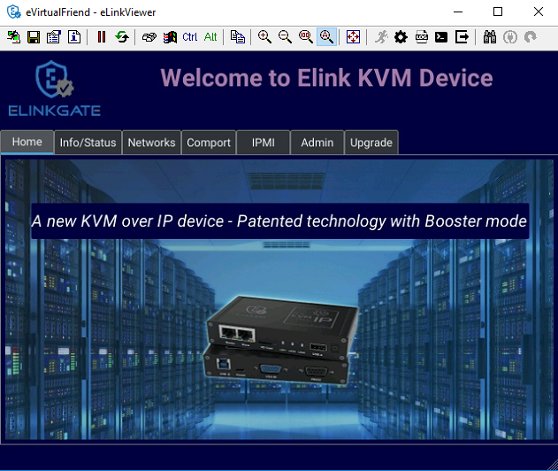

#### Quick usage ####

`Dummy` screen includes many tabs that displays an appropriate screen
for the functionality of each tab. Assume the eLinkKVM device is
properly setup with VGA cable attached, to start remote controlling,
simply switching from `Dummy` video screen to `VGA` video screen:

1. Click `ELink Configuration`.
2. Click `VGA`.
3. Click `OK`.

The default `Dummy` screen should be switched to the actual output
from the remote controlled computer.


#### Disconnect from an eLinkKVM device ####

* Click the button 
* The dialog box  announces connection successfully terminated. 


### b. Dummy Screen

#### i. Home

The default screen when successfully connected to an ElinkKVM device.


#### ii. Info/Status

Display the basic information of an eLinkKVM device. The following
information is displayed:


#### iii. Networks

Display the current network configuration of an eLinkKVM device and
allows changes accordingly:

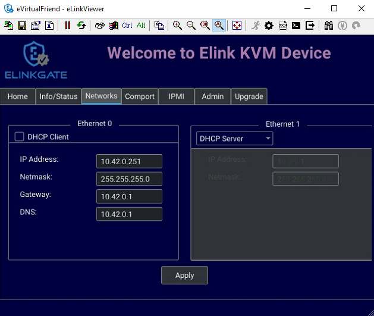


#### iv. COM Port

Display the current COM port configuration of an eLinkKVM device and
allows changes accordingly:

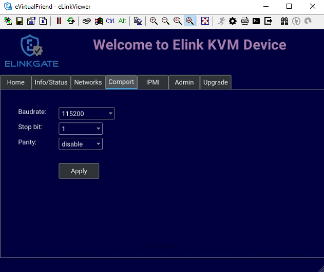

#### v. IPMI

Display the current IPMI configuration of an eLinkKVM device and
allows changes accordingly:


#### vi. Admin

#### vii. Upgrade

Display the current firmware version of an eLinkKVM device and allows
upgrading to a newer firmware. The firmware must be first uploaded
onto the device using `File Transfer` feature of eLinkViewer.

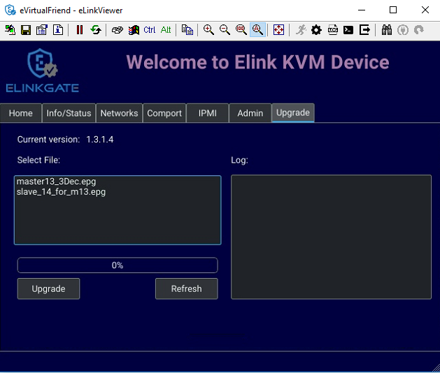

### c. eLinkKVM Toolbar ###

Connection user interface:


1. Create a new connect to an eLinkKVM device

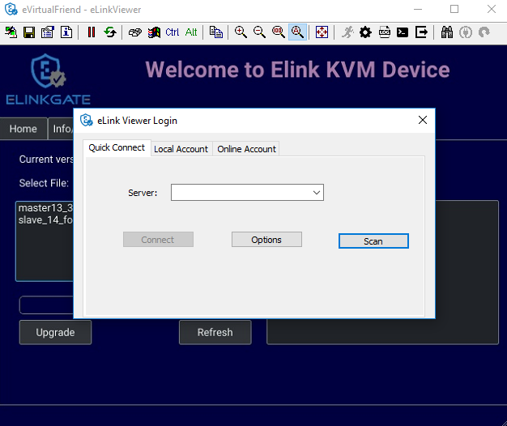

2. Store current vnc session as a `.vnc` file

3. eLinkKVM connect options

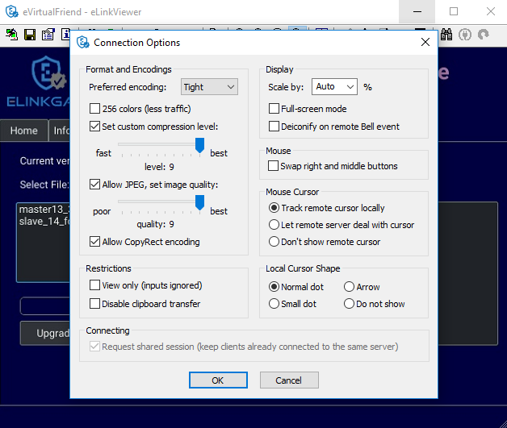

4. Current connection status
5. Pause frame transmitting
6. Request refresh current remote screen
7. Send `Ctrl + Alt + Delete` key combination
8. Press/Hold `Ctrl` key
9. Press/Hold `Alt` key
10. Open eLinkViewer `File Transfer` window


eLinkViewer allows data transfer from a local PC to an eLinkKVM device
with `File Transfer`:

* Click **`File Transfer`** on eLinkViewer toolbar . `File Transfer`
  window appears. To the left is a directory tree of the local PC, to
  the right is the directory tree of the eLinkKVM device.

* Browse the local directory tree and select a file or directory to
  upload to an eLinkKVM device. Next, on the directory tree of the
  eLinkKVM device, select a path to store the file or directory.

* Finally, click the button **`>>`** to transfer the selected
  file/directory. A confirm dialog appears. Click **`Yes`** to confirm
  or click **`No`** cancel the action. After confirming the transfer,
  the transfer starts and a progress bar that displays the transfering
  process starts running.


11. Scale in
12. Scale out
13. Scale (100%)
14. Auto zoom 
15. Full screen (press `Ctrl + Shift + Alt + F` to return to windowed eLinkViewer)
16. Turn booster mode on/off
17. eLinkKVM Configuration
18. Open event log 
19. Open Python script command prompt
20. Disconnect
21. Scan IPMI 

 


### d. Keyboard, Video and Mouse Settings


The viewer provides a dialog called `Elink Configuration` that includes the following options to configure how an eLinkKVM emulates keyboard, video and mouse.

#### Key: ####

* HID USB : use real keyboard (USB). 
* HID VNC : use software keyboard (VNC protocol)
* Serial: use software keyboard (serial protocol)

#### Mouse: ####

* HID USB : use real mouse (USB)
* HID VNC: use software mouse (VNC protocol)
* ABS USB: use real mouse, but sync both local and remote mouse as one mouse pointer (USB absolute hid)

#### Video: ####

* Dummy : configure network and serial connections
* VGA: configure VGA display
* Booster: enable remote management with Booster. This will be covered in later chapters. 
* Serial: enable serial display and communication
* IPMI:  enable Serial Over Lan (SOL) with IPMI 

#### File browsing and disk image mounting: ####

* Path 0/1/2/3: File paths to disk images

* `Browse` button allows navigating to the disk images with a file
  explorer:


* Example: Configure eLinkKVM to use USB Key, Vnc Mouse and Booster
  mode with `refind.hdd2` disk image:


### e. Python Cnsole UI


### f. Event Log UI

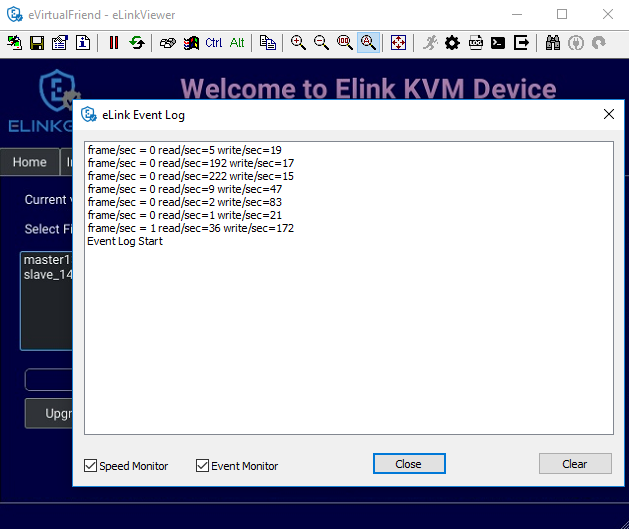

### g. IPMI Command Center

IPMI Interface:


IPMI command center allows a user to scan servers with IPMI ports in a local area network and connect to these server to run IPMI commands.

* Start IP: start IP to begin scanning
* Stop IP: End IP to end scanning
* User Name - Password: user name and password for each IPMI server. For example, default username and passwork are ADMIN/ADMIN for a SuperMicro server.
* Scan : start scanning for an IPMI server 
* Stop: End a current scanning process
* Connect: connects to an IPMI server. When an IPMI server is found, an IP address is display, click on the IP address to select then enter a Username and Password.
* Power On: Turn a server on with IPMI
* Reset  with   
* Reset : restart a server
* Reset to Bios Setup: restart a server and enter BIOS
* Reset to USB: restart a server and boot with a USB device
* Sol Active: enable IPMI management with Serial Over Lan (SOL)
* Close : Close IPMI command center

Use IPMI command center to scan and run IPMI commands. 

* Click 
* Enter Start IP and end IP. Limit the ranger of IP scanning. 
* Click `Scan` to start scanning. Found IPMI servers are displayed as a list.
* Click on one of the found IPMI IP addresses, enter `Username` and `Password`, then click **`Connect`** 
* Click **`Power On`**,  **`Reset`**, etc., to run appropriate IPMI commands.


## Chapter 4: eLinkKVM Configuration

### a. User Management

### b. Network Configuration

##### Static IP configuration

Steps to configure static IP for an eLinkKVM device:

1. Power up an eLinkKVM device and wait for the device to start up completely (all LED1 , LED2, LED 3 light up).

2. Use a Ethernet (RJ45) cable to connect a PC to the Ethernet Master port. The default IP is `10.0.0.1`.

4. Open eLinkViewer, enter `*10.0.0.1*` and click `Connect` to connect to the eLinkKVM device:


When connected, eLinkViewer displays its home screen with many tabs for different screens. One of the tab is `Network`. Click on `Network` tab to move to this screen:


5. The `Network` screen displays the following fields: 

- IP Address
- Netmask
- Gateway
- DNS

Similar to how an ethernet adapter can be configured in an operating system.

**Example**:

Instead of using the default IP address `10.0.0.1`, the IP address of the connected eLinkKVM can be changed to `10.0.0.2`.

```
Ip address: 10.42.0.2
Netmask: 	255.255.255.0 
GateWay: 	10.42.0.1 
DNS: 		10.42.0.1
```


##### Dynamic IP Configuration

Dynamic IP address is acquired automatically, issued by a DHCP server. In this case, the connected eLinkKVM device must be configured as a DHCP client.

[TODO] Put a screenshot showing how to select DHCP Client

### c. IPMI Configuration

### d. Offline Configuration

eLinkKVM supports configuration with a text file. Steps: 


1. Press `Enter Configuration` button an eLinkKVM device. The firmware on the eLinkKVM device then configures itself as a storage device.
2. Open the drive `ELINKCONF`.
3. In `ELINKCONF` drive, there is a configuration file that can be editted by any text editor. 
4. Edit the file following eLinkKVM configuration syntax. Store the file and reset eLinkKVM to use the new configuration.


### e. Factory Reset


## Chapter 5: Booster Mode

Booster is a patented technology for eLinkKVM and related ElinkGate
products. Booster includes software agents for each major OS platform
(Windows, Linux and Mac OS) that are installed on controlled
computers. When an eLinkKVM device is attached to a controlled
computer, the installed software agent is activated to cooperate with
a eLinkKVM device using a specialized proprieteray protocol. The
software agent then utilizes the available computing resources on the
controlled computer to greately accelerate video input and output
processing. As a result, eLinkKVM can deliver higher performance at
higher resolutions for an extremely economical price.

To enable Booster techonlogy, a user only needs to install the
accompanied software components on an existing operating-system
installation. For a fresh computer that need a new operating-system
installation, a tool called `elinkSetuptool` is provided to help
creating install disk images with embedded Booster from existing
installation ISO files, which is covered in the next chapter.

These disk images can be loaded on eLinkKVM internal storage for
remote operating-system installations on new computers with Booster
enabled through the whole installation process. After the installation
process is done, the freshly installed operating system is also
pre-installed with Booster software to allow a user to continue using
Booster without any interruption.


Once a Booster agent is installed on a respective operating system,
simply click the `Booster` icon to start getting remote screen with
Booster. 

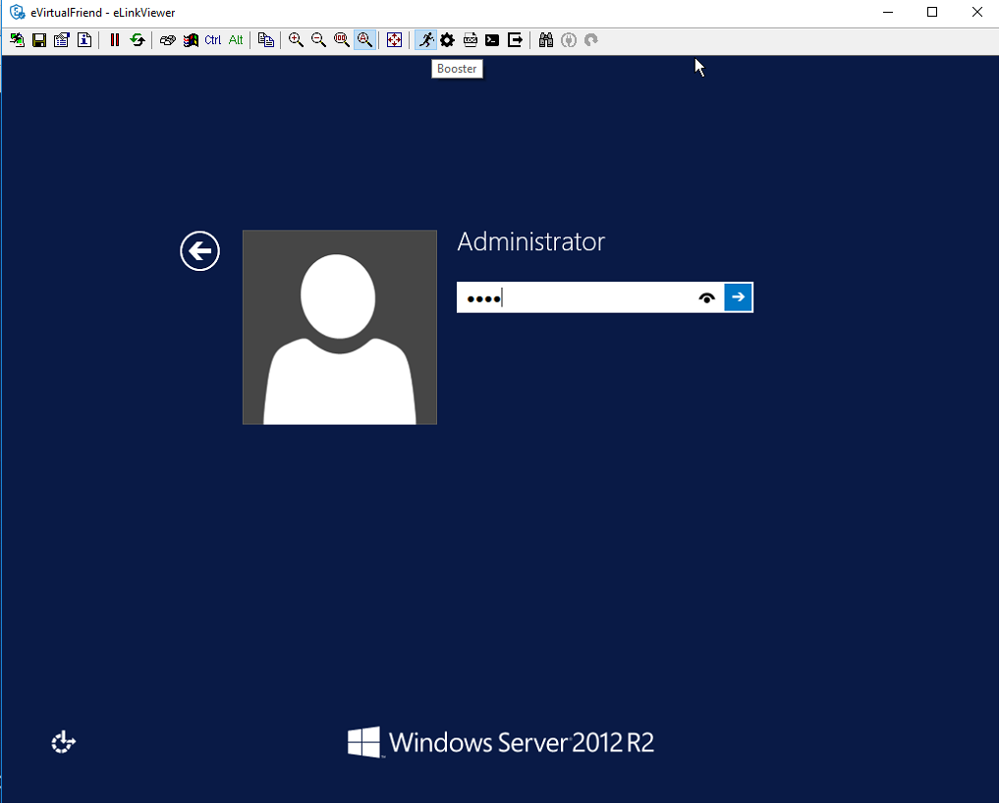

Screen quality may improve slightly or significantly compared to VGA
hardwrae mode, depends on the quality of the VGA cable. Remote
keyboard and mouse interactions become much more responsive.

### Customize Booster Mode ###

To make it convenient to switch between Booster and other modes,
eLinkViewer allows a user to customize Auto Booster Toggle
button. Pressing this button allows a user to switch between a
pre-configured Booster mode and the current mode.


Steps to configure Booster mode:

1. Click `ELink Configuration` button.

2. From `ELink Configuration` select a remote display mode.

3. Similarly, select a Key mode

4. Next, select a Mouse mode

5. Select `Base` to confirm configuration. This configuration is used whenever `Auto Booster Mode` button is clicked.

6. Press OK to save the configuration.

7. Press OK to confirm.


## Chapter 6: elinkSetuptool ###

`elinkSetuptool` is an image creation tool that recreates OS
installation images into disk images with `Booster` agents installed.
